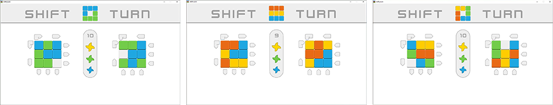

# "Shift turn"
___

### Описание игры:
>Головоломка, которая бросит вызов настоящим любителям сложных игр.
>Собирая одну сторону, помните, что другая движется в противоположном
>направлении. Сможете ли вы решить ее?

### Game description:
>A puzzle game that will challenge true fans of challenging games.
>while picking one side, remember that the other is moving in the opposite
>direction. Can you solve it?


### Игра опубликована на ресурсах / the game is published on:
>https://chuikoalex.itch.io/shift-turn
> 
>https://gamejolt.com/games/shift-turn/786342
___



___

#### Используемые библиотеки / libraries used:
+ pygame - *(основные ресурсы / basic resources)*
+ numpy - *(обработка матриц / matrix processing)*
+ pickle - *(сохранение игры / game saving)*
+ random - *(элементы случайностей / elements of randomness )*


#### files:
```
/font
/img
requirements.txt
README.md
shift-turn.png
shift-turn.ico
main.py ('get started')
board.py
btn.py
game.py
menu.py
message.py
score.py
settings.py
tiles.py 
setting.py
```
>> Python 3.10


 
